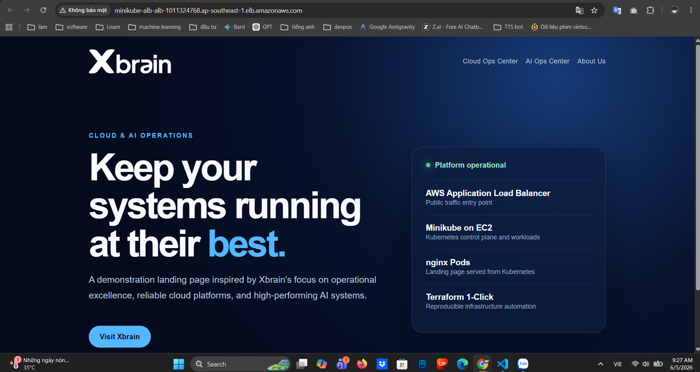
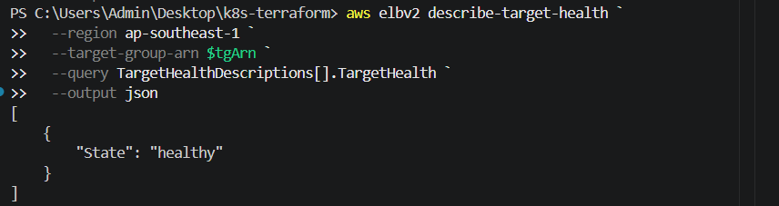

# Evidence Pack - K8s on AWS Terraform 1-Click

> File này dùng để gom bằng chứng nộp/chấm bài. Sau khi chạy lại `terraform apply`, chèn ảnh browser/console vào các mục bên dưới.

## 1. Thông Tin Bài Làm

```text
Project: K8s on AWS - Terraform 1-Click
Cloud: AWS
Kubernetes: Minikube on EC2
App: nginx landing page
Expose: AWS Application Load Balancer
Terraform providers: aws, cloudinit
Region mặc định: ap-southeast-1
Instance type mặc định: t3.small
```

## 2. Acceptance Checklist

| Acceptance | Trạng thái | Bằng chứng |
| --- | --- | --- |
| 1 lệnh từ repo sạch → app chạy | Cần chạy lại để chụp | `terraform init; terraform apply -auto-approve` |
| URL ALB trả về trang app | Cần chụp ảnh browser | Ảnh browser mở `app_url` |
| App chạy trong K8s, không cài thẳng EC2 | Có | `kubectl get all`, Deployment/Pods/Service |
| Có ≥2 Terraform provider | Có | `versions.tf`, `main.tf` |
| Giải thích được thiết kế | Có | `README.md`, `PRESENTATION_NOTES.vi.md` |
| Reproducible | Có | Terraform code + cloud-init bootstrap |
| Destroy sạch sau khi xong | Đã test | `Destroy complete! Resources: 17 destroyed.` |

## 3. Lệnh Deploy

Chạy từ repo sạch:

```powershell
terraform init; terraform apply -auto-approve
```

Lấy URL ALB:

```powershell
terraform output -raw app_url
```

Ví dụ URL sau lần chạy trước:

```text
http://minikube-alb-alb-1920977527.ap-southeast-1.elb.amazonaws.com
```

Lưu ý: sau khi `terraform apply` xong, EC2 vẫn cần vài phút để cloud-init tải image Minikube/Kubernetes và deploy app. Trong thời gian đó ALB có thể trả `502`. Đợi Target Group chuyển `Healthy`.

## 4. Bằng Chứng Browser

Chèn ảnh tại đây:

```text
Ảnh cần có:
- Thanh địa chỉ hiển thị URL ALB
- Trang landing page Xbrain Cloud & AI Operations mở thành công
```



Kết quả mong đợi trên trang:

```text
Xbrain Cloud & AI Operations
Keep your systems running at their best.
Platform operational
AWS Application Load Balancer
Minikube on EC2
nginx Pods
Terraform 1-Click
```

## 5. Bằng Chứng ALB Healthy

Lệnh kiểm tra:

```powershell
aws elbv2 describe-target-health `
  --region ap-southeast-1 `
  --target-group-arn <target-group-arn> `
  --query TargetHealthDescriptions[].TargetHealth `
  --output json
```

Kết quả lần chạy trước:

```json
[
  {
    "State": "healthy"
  }
]
```

Chèn ảnh AWS Console nếu cần:

```text
EC2 -> Target Groups -> minikube-alb-tg -> Targets -> Health status: Healthy
```



## 6. Bằng Chứng App Chạy Trong Kubernetes

Kết nối EC2 bằng AWS Systems Manager hoặc chạy command qua SSM.

Lệnh kiểm tra:

```bash
kubectl get all
```

Kết quả lần chạy trước:

```text
NAME                             READY   STATUS    RESTARTS   AGE
pod/hello-app-57485754ff-hxdqx   1/1     Running   0          3m26s
pod/hello-app-57485754ff-zrtwg   1/1     Running   0          3m26s

NAME                 TYPE        CLUSTER-IP       EXTERNAL-IP   PORT(S)        AGE
service/hello-app    NodePort    10.103.211.201   <none>        80:30080/TCP   3m28s
service/kubernetes   ClusterIP   10.96.0.1        <none>        443/TCP        3m33s

NAME                        READY   UP-TO-DATE   AVAILABLE   AGE
deployment.apps/hello-app   2/2     2            2           3m28s

NAME                                   DESIRED   CURRENT   READY   AGE
replicaset.apps/hello-app-57485754ff   2         2         2       3m27s
```

Ý nghĩa:

```text
Deployment hello-app có 2 replicas.
2 Pods đang Running.
Service hello-app là NodePort 80:30080.
=> App chạy trong Kubernetes, không phải cài trực tiếp trên EC2.
```

Kiểm tra ConfigMap landing page:

```bash
kubectl get configmap hello-app-html
kubectl describe configmap hello-app-html
```

## 7. Bằng Chứng Minikube Chạy Trên EC2

Lệnh kiểm tra trên EC2:

```bash
minikube status
kubectl get nodes -o wide
docker ps
```

Kết quả mong đợi:

```text
minikube
type: Control Plane
host: Running
kubelet: Running
apiserver: Running
kubeconfig: Configured
```

Ý nghĩa:

```text
EC2 là host.
Docker chạy trên EC2.
Minikube dùng Docker driver để tạo Kubernetes single-node cluster.
App chạy trong Pod của cluster đó.
```

## 8. Bằng Chứng 2 Provider Được Wire

File khai báo provider:

```text
versions.tf
```

Provider 1:

```hcl
provider "aws" {
  region = var.aws_region
}
```

Provider 2:

```hcl
provider "cloudinit" {}
```

File wire provider:

```text
main.tf
```

Đoạn `cloudinit` render bootstrap script:

```hcl
data "cloudinit_config" "minikube" {
  gzip          = true
  base64_encode = true

  part {
    content_type = "text/x-shellscript"
    content = templatefile("${path.module}/templates/bootstrap.sh.tftpl", {
      minikube_version = var.minikube_version
      kubectl_version  = var.kubectl_version
    })
  }
}
```

Đoạn `aws` provider nhận output từ `cloudinit`:

```hcl
resource "aws_instance" "minikube" {
  user_data_base64 = data.cloudinit_config.minikube.rendered
}
```

Luồng wire:

```text
bootstrap.sh.tftpl
  -> cloudinit_config.minikube.rendered
  -> aws_instance.minikube.user_data_base64
  -> EC2 cloud-init chạy script
  -> Minikube + Kubernetes app được tạo
```

Câu giải thích ngắn:

```text
Em dùng cloudinit provider để render bootstrap script thành user_data_base64.
Sau đó em truyền output đó vào aws_instance của aws provider.
Khi EC2 boot, cloud-init chạy script để cài Docker, Minikube, kubectl và deploy app vào Kubernetes.
```

## 9. Bằng Chứng App Không Cài Thẳng Trên EC2

Trong `templates/bootstrap.sh.tftpl`, app được khai báo bằng Kubernetes manifest:

```text
ConfigMap hello-app-html
Deployment hello-app
Service hello-app
```

Container image:

```text
nginx:1.27-alpine
```

App được mount HTML từ ConfigMap vào nginx Pod:

```text
ConfigMap -> volume -> /usr/share/nginx/html
```

EC2 không serve landing page bằng nginx package host-level. EC2 chỉ chạy:

```text
Docker
Minikube
kubectl
socat proxy
```

## 10. Luồng Traffic

```text
Browser
  -> ALB :80
  -> EC2 :8080
  -> systemd socat proxy
  -> Minikube NodePort :30080
  -> Kubernetes Service hello-app
  -> nginx Pod
  -> HTML landing page
```

Security:

```text
ALB Security Group:
  - Inbound 80 từ Internet

EC2 Security Group:
  - Inbound 8080 chỉ từ ALB Security Group
  - Không mở SSH 22
  - Không mở NodePort 30080 ra Internet
```

## 11. Bằng Chứng Destroy Sạch

Lệnh destroy:

```powershell
terraform destroy -auto-approve
```

Kết quả đã chạy:

```text
Destroy complete! Resources: 17 destroyed.
```

Kiểm tra state sau destroy:

```powershell
terraform state list
```

Kết quả:

```text
<trống>
```

Ý nghĩa:

```text
Terraform không còn quản lý resource nào.
EC2, ALB, VPC, subnet, security group, IAM role đã được xóa.
Không tiếp tục phát sinh chi phí từ bài lab.
```

## 12. Ảnh/Clip Cần Nộp

Nên nộp tối thiểu:

```text
1. Ảnh browser mở URL ALB thành công.
2. Ảnh AWS Target Group Healthy.
3. Ảnh terminal/SSM chạy kubectl get all.
4. Ảnh hoặc log terraform destroy thành công.
```

Checklist trước khi nộp:

```text
[ ] README.md có lệnh chạy.
[ ] README.md có sơ đồ kiến trúc.
[ ] README.md giải thích provider wiring.
[ ] Browser mở được app qua ALB.
[ ] Có bằng chứng Pods Running.
[ ] Có bằng chứng Target Group Healthy.
[ ] Đã destroy sau khi chụp bằng chứng.
```
